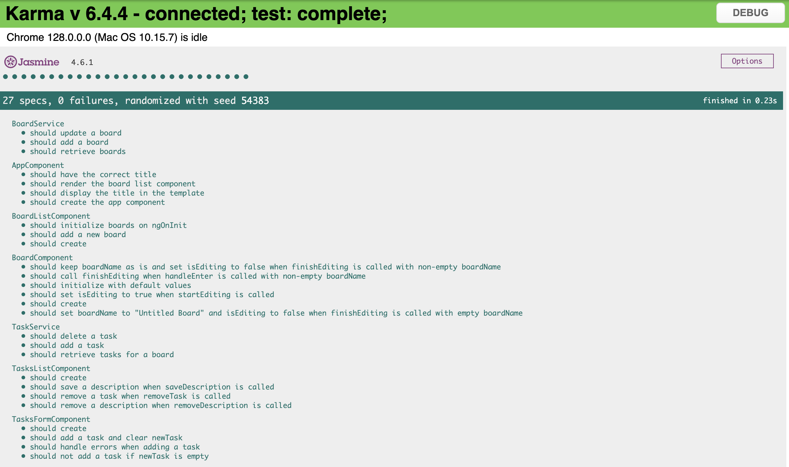
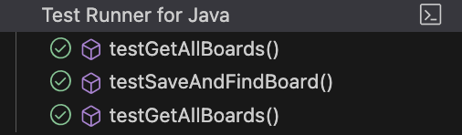

# Ericsson Nikola Tesla assignement

The assignement: Creation of a task manager app(similar to Trello)

# Requirements:

- add a new board
- add a new card within a board
- add a description inside of a card

Technologies used:

- frontend: Angular 18 and Tailwind for styling
- backend: Spring Boot Java 21
- database: H2

# HowTo start an app

In terminal, navigate to trello_clone folder. Run ./gradlew bootRun . In another terminal navigate to task-manager-app, npm i and ng serve to start the app

# App preview:

# TODO:

Frontend:

- improve accesibility(eg.adding labels, aria-labels)
- improve test coverage and code readability
- add error handling in services
- Improve UI: add consistency with user input - buttons and onEnter for all inputs, add Delete Board option, improve user flow with task adding
- at the moment on page reload tasks are not saved in the database, investigate state management and update services (please see ./assets/noTaskSave.gif, dbh2board.png, dbh2task.png)
- improve component structure and naming
- add user authentication

Backend:

- improve test coverage and code readability
- improve mapping of tasks to the appropriate board
- clean up code
- improve files structure and naming
- add CORS config

# Test Results

Frontend: 

Backend: 
